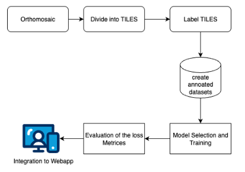
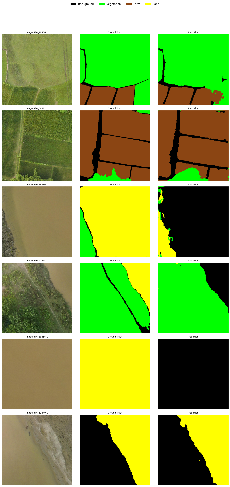
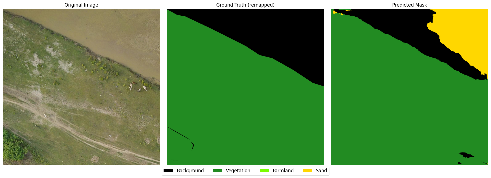
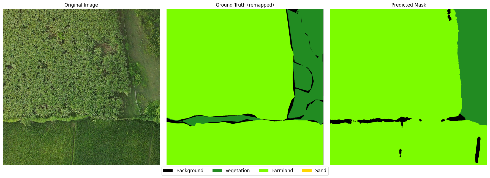
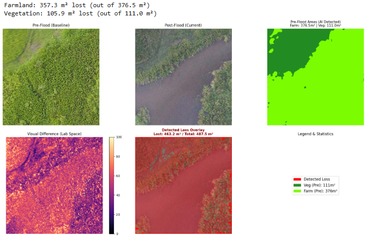
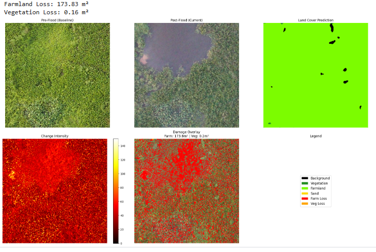

# 🌾 Farm Land Analysis: AI-Driven Disaster Assessment


**Project Focus:** Semantic Segmentation for Post-Disaster Assessment & Agricultural Monitoring in Nepal.
#### 🔗 Problem Statement
- 📄 [README Problem Statement](./README_PROBLEM_STATEMENT.md)


<!-- **Best Model:** UNet++ (EfficientNet-B4) | **mIoU:** 0.7518 | **mDice:** 0.855 -->


## 📖 Project Overview

The **Farm Land Analysis Team** is developing an integrated computer vision system to analyze agricultural landscapes using high-resolution drone **orthomosaic imagery**. The primary goal is to automate the monitoring of farming regions across Nepal's valleys and assess land degradation caused by natural disasters (floods).

This repository contains the implementation of **Phase 1: Semantic Segmentation**. By classifying pixels into land cover types, we aim to quantify agricultural land, vegetation coverage, and areas affected by sand deposition (riverine damage).

---

## 🏗️ Workflow Pipeline

Due to the massive size of geospatial `.tif` orthomosaics, standard image loading is impossible. We devised a custom pipeline to handle geospatial data efficiently:

s
1.  **Data Acquisition:** High-resolution Pre-flood and Post-flood GeoTIFFs.
2.  **Tiling Strategy:** 
    *   Orthomosaics are sliced into manageable **1024x1024** tiles.
    *   Tiles are filtered to remove empty/black boundary regions.
3.  **Annotation (Roboflow):**
    *   Selected tiles (currently Pre-flood) were uploaded to Roboflow.
    *   Manual polygon annotation was performed for Vegetation, Farmland, and Sand.
4.  **Dataset Creation:** Exported annotated tiles into semantic masks.
5.  **Model Training:** Iterative experiments with various Deep Learning architectures.

---

## 🎯 Target Classes

We focus on 3 primary Classes of Interest (plus Background):

| Class ID | Class Name | Description | Count (Instances) |
| :--- | :--- | :--- | :--- |
| **0** | **Background** | Irrelevant areas / Clutter | N/A |
| **1** | **Vegetation** | Trees, forests, and dense shrubbery | **1,709** |
| **2** | **Farmland** | Cultivated rice paddies and crop fields | **1,685** |
| **3** | **Sand** | Riverine sand deposition (flood damage indicator) | **268** ⚠️ |

*> **Note:** There is a significant class imbalance, with "Sand" being the minority class, making it the most challenging feature to segment.*

---

## 🧪 Model Experiments & Results

We followed an iterative approach, starting from a baseline and increasing complexity. Below is the performance history:

| Model | Architecture | Encoder | Classes | Train/Val/Test Split | mIoU | mDice | Notes |
| :--- | :--- | :--- | :--- | :--- | :--- | :--- | :--- |
| **Baseline** | Basic UNet | Standard | 7 | 55 / 14 / — | — | 0.112 | Failed due to tiny dataset & too many classes. |
| **V2** | UNet | VGG16 | 5 | 443 / 48 / 25 | 0.6369 | 0.7611 | Major improvement. Good on Farmland. |
| **V3** | UNet | ResNet-34 | 4 | 698 / 48 / 25 | 0.6769 | 0.7911 | ResNet features improved stability over VGG. |
| **V4 (Best)**| **UNet++** | **EfficientNet-B4** | **4** | **702 / 101 / 55** | **0.7518** | **0.8550** | **Best performance.** High spatial coherence. |

### 🏆 Current Best Model: UNet++
The **UNet++** architecture with an **EfficientNet-B4** encoder (pre-trained on ImageNet) provided the best trade-off between feature extraction and mask reconstruction.
*   **Loss Function:** Combined Dice Loss (0.4) + Focal Loss (0.6) to handle the class imbalance.
*   **Optimizer:** AdamW with Cosine Annealing Warm Restarts.

---
## 📊 Damage Assessment Strategy (Loss Calculation)

A critical component of this project is quantifying the **Land Loss** caused by floods. Since we currently do not have annotations for *Post-flood* images, we utilize a hybrid approach combining our **Deep Learning Model** with **Spectral Indices (NDVI/NDWI)**.

**The Algorithm:**

1.  **Baseline Identification (Pre-Flood):**
    *   We run our trained Segmentation Model on **Pre-flood** tiles.
    *   We extract masks specifically for **Farmland** and **Vegetation**.
    *   *Note:* We ignore the "Sand" class in the pre-flood prediction, as our goal is to track where fertile land *used* to be.
2.  **Temporal Comparison:**
    *   We map these predicted fertile pixels to the exact same coordinates in the **Post-flood** tiles.
3.  **Spectral Analysis:**
    *   For those specific pixels, we calculate **NDVI** (Normalized Difference Vegetation Index) and **NDWI** (Normalized Difference Water Index) on the Post-flood image.
    *   *Logic:* If a pixel was "Farmland" in the Pre-image but has a drastically low NDVI (or high sand signature) in the Post-image, it is classified as **Damaged/Lost**.
4.  **Area Quantification:**
    *   We calculate the total "Lost" pixels.
    *   We multiply the pixel count by the **Ground Sampling Distance (GSD)** found in the GeoTIFF metadata (spatial resolution) to generate the final loss report in **Square Meters ($m^2$)**.

---
## 📸 Visual Results: Segmentation
From unet++ with encoder(efficientnet B4):



From unet with encoder(resnet34):






Loss Analysis: 



---
## 🛠️ Tech Stack

*   **Framework:** PyTorch
*   **Segmentation Lib:** `segmentation_models_pytorch` (SMP)
*   **Augmentation:** Albumentations (Geometric + Texture transforms)
*   **Annotation:** Roboflow
*   **Compute:** CUDA (GPU accelerated training)

---

## ⚠️ Challenges Faced

1.  **Large GeoTIFF Handling:**
    *   *Issue:* Loading 10GB+ images into RAM crashes sessions.
    *   *Solution:* Implemented a tiling script to chunk data into 1024x1024 segments before processing.
2.  **Class Imbalance:**
    *   *Issue:* "Sand" appears rarely compared to "Vegetation". Early models ignored Sand entirely.
    *   *Solution:* Utilized **Focal Loss** and **Dice Loss** to heavily penalize the model for missing minority classes.
3.  **Annotation Inconsistencies:**
    *   *Issue:* Distinguishing between "Fallow Farmland" and "Sand" or "Scattered Trees" vs "Forest" is visually difficult.
    *   *Solution:* Iterative refinement of annotation guidelines.
4.  **Dataset Size:**
    *   Starting with only 50 images resulted in poor generalization. Scaling to ~858 tiles significantly improved mIoU.

---

## 🚀 Future Enhancements

The project is currently in **Phase 1 (Segmentation)**. The roadmap for Phase 2 includes:

1.  **Refined Annotations:** Conduct a peer-review of masks to fix boundary errors in the training set.
2.  **Hyperparameter Tuning:** Systematically tune Learning Rate, Batch Size, and Loss Weights (Optuna).
3.  **Dataset Expansion:** Integrate **Post-flood** tiles into the training set to make the model robust to seasonal changes.
4.  **Land Loss Quantification:** Develop a script to calculate the exact area ($m^2$) of "Sand" in post-flood images to automate damage assessment reports.
5.  **Object Detection Integration:** (Long-term) Add YOLO/Faster-RCNN to detect discrete farmhouses or specific infrastructure.

---
## 🏃 How to Run

1. **Install Dependencies:**
    ```bash
    pip install torch torchvision albumentations segmentation-models-pytorch matplotlib tqdm rasterio
    ```

    **or install everything from `requirements.txt`:**
    ```bash
    pip install -r requirements.txt
    ```


2. **Configure Paths:**
    Update the `CONFIG` dictionary in `configs/training_config.py` with your dataset path:
    ```python
    CONFIG = {
        "ROOT_DIR": "/path/to/dataset",
        "IMG_SIZE": 512,
        ...
    }
    ```

3. **Start Training:**
    ```bash
    python main.py
    ```

---

### 📌 Note: Tiling Orthomosaic Files

If your dataset consists of large orthomosaic `.tif` files, you must **generate tiles first**:

➡️ Run the tiling pipeline:
```bash
python tiling/main.py
```
Before running, update paths and settings in:
```bash
tiling/settings.py
```

---
## 👥 Meet the Team

| Name | Links |
| :--- | :--- |
| **Dharmendra Singh Chaudhary** | [](https://github.com/dharmendra016) [](https://www.linkedin.com/in/dharmendra-singh-chaudhary/) |
| **Shubham Thapa** | []() [](https://np.linkedin.com/in/shubham-thapa-7887632b9) |
| **Sangam Paudel** | [](https://github.com/sangampaudel530) [](https://www.linkedin.com/in/sangampaudel530/) |
| **Sushan Shakya** | [](https://github.com/SushanShakya) [](https://www.linkedin.com/in/sushan-shakya-8953711a6/) |


---

**Farm Land Analysis Team**  
*Developing AI solutions for Resilient Agriculture.*